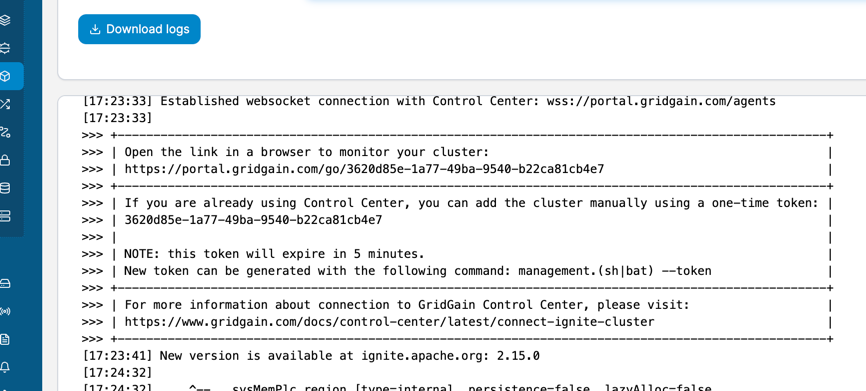
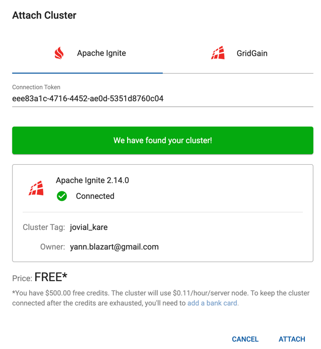
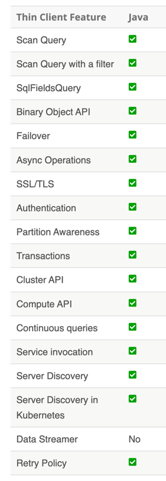

= TP1 Lab Exercise 1: Discovering Apache Ignite with Quarkus as a Pure Client

== Prerequesite

Do a mvn clean install at the project root

== Deploying 3 Ignite Server Nodes

We have a project that prepares Ignite servers.

To deploy it, please execute from project root:

For Linux/Mac:

[source,shell]
----
cd ignite
./mvnw clean install
chmod +x ./target/apache-ignite-2.14.0-bin/bin/ignite.sh
----

For Windows:

[source,shell]
----
cd ignite
./mvnw.cmd clean install
----

Once the preparation is done, we can run the following commands #three times# (once per terminal):

For Linux/Mac from ignite module root:

[source,shell]
----
cd ./target/apache-ignite-2.14.0-bin
export OPTION_LIBS=ignite-rest-http,ignite-calcite
export CONFIG_URI=file://config/node-configuration.xml
export JVM_OPTS="-Xms256m -Xmx512m -server -XX:MaxMetaspaceSize=256m -XX:MaxDirectMemorySize=256m"
./bin/ignite.sh
----

For Windows PowerShell:

[source,shell]
----
$env:OPTION_LIBS = 'ignite-rest-http,ignite-calcite'
$env:CONFIG_URI = 'file://config/node-configuration.xml'
$env:JVM_OPTS = '-Xms256m -Xmx512m -server -XX:MaxMetaspaceSize=256m -XX:MaxDirectMemorySize=256m'
./target/apache-ignite-2.14.0-bin/bin/ignite.bat
----

In the logs of one of the nodes, you will find the URL to connect a monitoring tool provided by GridGain: 

Copy and paste this URL into your favorite browser and sign up (for free). You can then explore your cluster. We will use Nebula later.

 image:../resources/images/screen5.png[img.png]

*Attention:* The registration token is only valid for 5 minutes!

Apache Ignite provides a standard REST API, which we will use to check the cluster's operation. The following file, link:src/http-requests/ignite-rest/get-version.http[here], contains the request to execute:

[,http request]
----
http://localhost:8080/ignite?cmd=version
----

== Quick Creation of a Quarkus Client

Now with your terminal go to tp1-2 module

[source,shell]
----
cd ../tp1-2
----

You may have noticed that Ignite REST services listen on port 8080. We need to tell Quarkus to use a different port.

In the application.properties file in the resources, add the following property:

[,properties]
----
quarkus.http.port=8083
----

Let's move on to the client. Add a Producer that will create an instance of the IgniteClient object:

[source,java]
----
@ApplicationScoped
@RequiredArgsConstructor
@Slf4j
public class IgniteClientProducer {

    @Produces
    @ApplicationScoped
    public IgniteClient igniteClient() {
        ClientConfiguration cfg = new ClientConfiguration().setAddresses("127.0.0.1:10800");
        return Ignition.startClient(cfg);
    }

    public void disposeIgniteClient(@Disposes IgniteClient igniteClient) {
        igniteClient.close();
    }
}
----

Then create a REST service that will connect, retrieve an atomic counter, and increment it with each call:

[source,java]
----
@Produces(MediaType.APPLICATION_JSON)
@Path("/ignite/testconnect")
@Slf4j
@RequiredArgsConstructor
public class ConnectToIgniteCluster {
    private final IgniteClient igniteClient;

    @GET
    public Response testConnect() {
        ClientAtomicLong hitCounter = igniteClient.atomicLong("hitCounter", 0L, true);
        long counter = hitCounter.incrementAndGet();
        log.info("Current hit {}", counter);
        return Response.ok("{ Hit : \"" + counter + "\"}").build();
    }
}
----

Let's check the operation:

[source,shell]
----
./mvnw quarkus:dev
----

Then, once it's started, make several HTTP requests to http://localhost:8083/ignite/testconnect and check the logs to see what happens.

== Deploying a Second Instance of the Service

But how can we be sure that the counter isn't local? Well, we will use a second instance!

For Linux/Mac:

[source,shell]
----
./mvnw quarkus:dev -Dquarkus.http.port=8084 -Ddebug=5006
----

For Windows PowerShell:

[source,shell]
----
./mvnw quarkus:dev "-Dquarkus.http.port=8084" "-Ddebug=5006"
----

Now you can make the HTTP request on your second instance at http://localhost:8084/ignite/testconnect.

In the server logs, you will see the counters incrementing on both nodes.

== Explore Other Possibilities

The Apache Ignite Thin Java client provides a rich API that allows you to use most of Apache Ignite's features.

You can see the details in the official Apache Ignite documentation here: https://ignite.apache.org/docs/latest/thin-clients/java-thin-client

The main differences are in the capabilities of services, which, in the case of the thin client, must already be deployed on the server, unlike other modes that allow peer class loading. Thin clients also do not host data, except for near caches.

=== Caches (https://ignite.apache.org/docs/latest/key-value-api/basic-cache-operations)

Using the client-side cache API (https://ignite.apache.org/docs/latest/thin-clients/java-thin-client)

[source,java]
----
ClientCache<Integer, String> cache = client.cache("myCache");
----

Create a REST service to add data to a cache and another to read it. Use the Swagger UI to test your services (http://localhost:8083/q/dev-ui/io.quarkus.quarkus-smallrye-openapi/swagger-ui) (http://localhost:8084/q/dev-ui/io.quarkus.quarkus-smallrye-openapi/swagger-ui)
