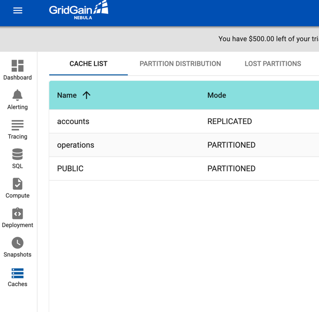
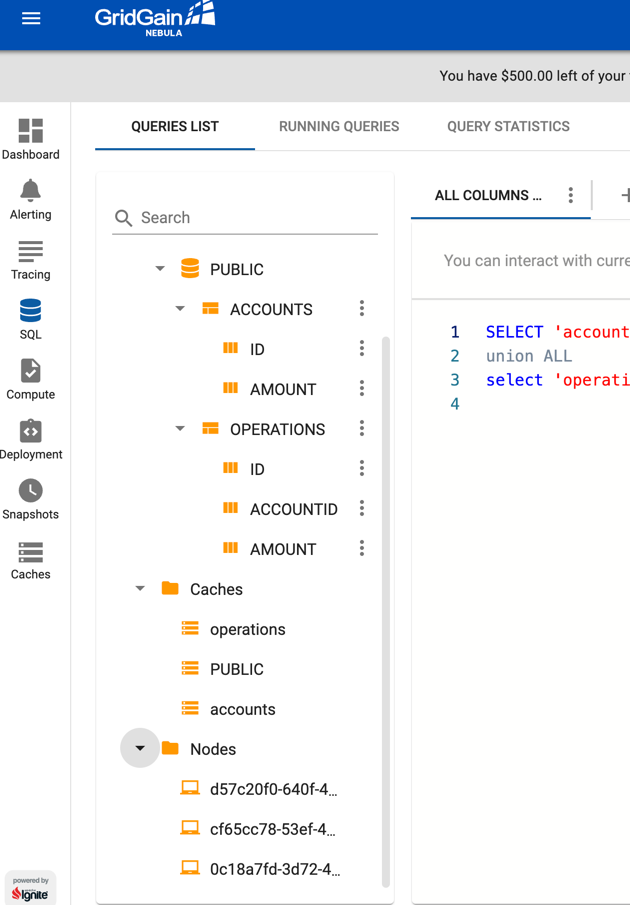
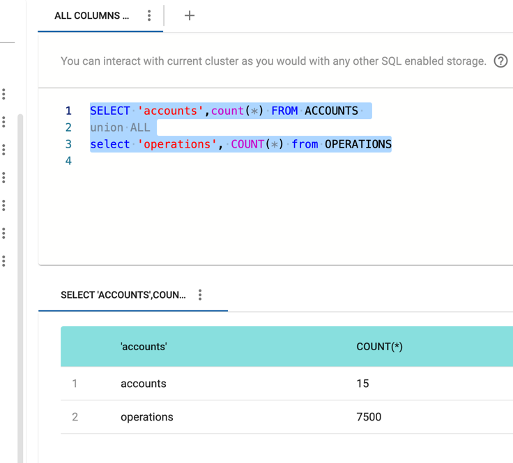
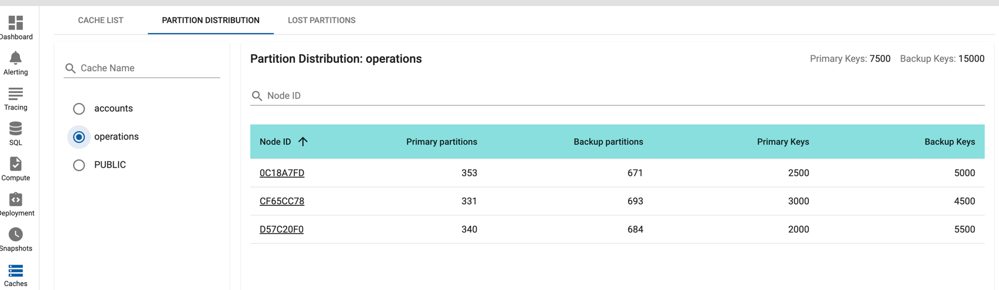

= Lab Exercise 2: Apache Ignite, a Distributed Database

== If You Haven't Completed TP1

=== Deploying 3 Ignite Server Nodes

We have a project that prepares Ignite servers.

To deploy it, please execute:

For Linux/Mac:

[,shell]
----
cd ../ignite
./mvnw clean install
chmod +x ./target/apache-ignite-2.14.0-bin/bin/ignite.sh
----

For Windows:

[,shell]
----
cd ../ignite
./mvnw.cmd clean install
----

Once the preparation is done, we can run the following commands three times (once per terminal):

For Linux/Mac:

[,shell]
----
cd ../ignite/target/apache-ignite-2.14.0-bin
export OPTION_LIBS=ignite-rest-http,ignite-calcite
export CONFIG_URI=file://config/node-configuration.xml
export JVM_OPTS="-Xms256m -Xmx512m -server -XX:MaxMetaspaceSize=256m -XX:MaxDirectMemorySize=256m   --add-opens java.base/java.lang.invoke=ALL-UNNAMED "
./bin/ignite.sh
----

For Windows PowerShell:

[,shell]
----
$env:OPTION_LIBS = 'ignite-rest-http,ignite-calcite'
$env:CONFIG_URI = 'file://config/node-configuration.xml'
$env:JVM_OPTS = '-Xms256m -Xmx512m -server -XX:MaxMetaspaceSize=256m -XX:MaxDirectMemorySize=256m'
../ignite\target\apache-ignite-2.14.0-bin/bin/ignite.bat
----

In the logs of one of the nodes, you will find the URL to connect a monitoring tool provided by Gridgain: image:../resources/images/screen3.png[img.png]

Copy and paste this URL into your preferred browser and sign up (for free). You will then be able to explore your cluster. We will use Nebula later.

image:../resources/images/screen4.png[img.png] image:../resources/images/screen5.png[img.png]

*Note* the registration token is valid for only 5 minutes!

== Creating SQL Tables in Apache Ignite:

The documentation for using SQL with Apache Ignite is https://ignite.apache.org/docs/latest/SQL/sql-introduction[here].

We use the Apache Calcite engine instead of H2 because in the embedded mode, different versions of H2 conflict between Ignite and Quarkus.

Ignite allows defining the storage topology of caches essentially in two modes:

* Replicated: Data is copied to all nodes.
* Partitioned: Data is distributed among nodes based on an affinity key that we provide. This allows, for example, co-locating data on the same nodes to optimize calculations.

Additionally, you can define a certain number of copies to ensure no data loss if a node goes down.

We will create "Accounts" and "Operations" Tables/Caches and populate them with test data.

=== Creating Tables.

The sources contain 2 SQL scripts that we will execute with the Thin Client.

Accounts Table:

[,sql]
----
create table if not exists ACCOUNTS
(
    id varchar(40) primary key,
    amount decimal(10,2)
) with "TEMPLATE=REPLICATED,BACKUPS=2,AFFINITY_KEY=id,CACHE_NAME=accounts,VALUE_TYPE=fr.sciam.lab.ignite.model.Account,KEY_TYPE=fr.sciam.lab.ignite.model.AccountKey";
----

Operations Table:

[,sql]
----
create table if not exists OPERATIONS
(
    id varchar(40) ,
    accountId varchar(40),
    amount decimal(10,2),
    primary key (id, accountId)
) with "TEMPLATE=PARTITIONED,BACKUPS=2,AFFINITY_KEY=accountId,CACHE_NAME=operations,VALUE_TYPE=fr.sciam.lab.ignite.model.Operation,KEY_TYPE=ffr.sciam.lab.ignite.model.OperationKey";
----

To apply these scripts, we will run them by creating a REST service in Quarkus. Create a class called CreateSchemas:

[,java]
----
@Path("/ignite/tp2/createSchemas")
@Slf4j
@RequiredArgsConstructor
public class CreateSchemas {
    private final IgniteClient igniteClient;
    @GET
    public Response createSchemas() throws IOException {
        ClientCache<Long, String> cache = igniteClient
                .getOrCreateCache(new ClientCacheConfiguration().setName("PUBLIC"));
        createTable(cache, "operations").getAll();
        createTable(cache, "accounts").getAll();
        return Response.ok().build();
    }
    private FieldsQueryCursor<List<?>> createTable(ClientCache<Long, String> cache, String table) throws IOException {
        String sql = IOUtils.toString(getClass().getResourceAsStream("/create-schema-" + table + ".sql"), StandardCharsets.UTF_8);
        log.info("Apply sql : {}",sql);
        return cache.query(new SqlFieldsQuery(sql));
    }
}
----

Then start your Quarkus:

[,shell]
----
./mvnw quarkus:dev
----

And then you can call your REST service link:src/http-requests/ignite-db/createSchemas.http[here].

You can then check in Nebula for the appearance of caches and tables in the Caches tab.

The 'distribution' tab allows you to see how partitions are distributed among each node.

On the left, you can click on 'SQL' to access H2's database querying tools.

=== JDBC Access

It is possible to use JDBC (with your preferred tool) to access the distributed database. The driver is located in the core jar.

[,xml]
----
<dependency>
    <groupId>org.apache.ignite</groupId>
    <artifactId>ignite-core</artifactId>
    <version>2.14.0</version>
</dependency>
----

The connection URL in our case is:

[,thymeleafurlexpressions]
----
jdbc:ignite:thin://localhost:10800/PUBLIC
----

And the driver:

[,java]
----
org.apache.ignite.IgniteJdbcThinDriver
----

== Data Generation

Our tables are there but empty. We could use the Nebula interface to populate them with INSERT, or we can use code to do it.

=== Java Model

First, let's create the Pojos that will help us in our task. You may have noticed in the SQL scripts that we refer to Java classes with additional VALUE_TYPE and KEY_TYPE parameters.

Indeed, the primary key of the table serves as the cache key, and the value in the cache represents the rest of the columns. So, we need to create two classes per Table in the package:

[,java]
----
package fr.sciam.lab.ignite.model;
----

Account Class:

[,java]
----
@Data
public class Account {
    private BigDecimal amount;
}
----

AccountKey Class:

[,java]
----
@Data
public class AccountKey implements Serializable {
    @AffinityKeyMapped
    private String id;
}
----

Operation Class:

[,java]
----
@Data
public class Operation {
    private BigDecimal amount;
}
----

OperationKey Class:

[,java]
----
@Data
public class OperationKey implements Serializable {
    private String id;
    @AffinityKeyMapped
    private String accountId;
}
----

You will notice the @AffinityKeyMapped annotation in the key classes. With these, we identify the fields that are used in affinity key calculations. This mechanism guarantees that when inserting data, Accounts and Operations with the same accountId will be stored on the same nodes.

=== Data Feeding

Now, let's create the service that will populate the tables. We will generate correct data, where the 'amount' in Accounts corresponds to the sum of 'amounts' in Operations. But also, a "fake" part to trigger a query on the cluster to extract problematic Accounts.

FeedDb Class:

[,java]
----
@Path("/ignite/tp2/feedDb")
@Slf4j
@RequiredArgsConstructor
public class FeedDb {
    public static final BigDecimal _100 = new BigDecimal(100);
    private final IgniteClient igniteClient;
    @SuppressWarnings("BigDecimalMethodWithoutRoundingCalled")
    @GET
    @Path("/{nbAccounts}/{nbAccountsInError}/{nbOperationsPerAccount}")
    public Response feedTheDb(@PathParam("nbAccounts") Integer nbAccounts, @PathParam("nbAccountsInError") Integer nbAccountsInError, @PathParam("nbOperationsPerAccount") Integer nbOperationsPerAccount) {
        ClientCache<AccountKey, Account> accounts = igniteClient.getOrCreateCache("accounts");
        ClientCache<OperationKey, Operation> operations = igniteClient.getOrCreateCache("operations");
        log.info("Get caches {} , {}",accounts,operations);
        for (int index = 0; index < nbAccounts + nbAccountsInError; index++) {
            AccountKey accountKey = new AccountKey();
            if (index < nbAccounts)
                accountKey.setId("GOOD-"+index);
            else
                accountKey.setId("BAD-"+index);
            Account account = new Account();
            account.setAmount(new BigDecimal(0));
            for (int indexOp = 0; indexOp < nbOperationsPerAccount; indexOp++) {
                Operation operation = new Operation();
                OperationKey operationKey = new OperationKey();
                operationKey.setAccountId(accountKey.getId());
                operationKey.setId(UUID.randomUUID().toString());
                operation.setAmount(new BigDecimal(new Random().nextInt(100000)).divide(_100));
                if (index < nbAccounts)
                    account.setAmount(account.getAmount().add(operation.getAmount()));
                operations.put(operationKey, operation);
                log.info("Put {}={}",operationKey,operation);
            }
            accounts.put(accountKey, account);
            log.info("Put {}={}",accountKey,account);
        }
        return Response.ok().build();
    }
}
----

Once in place, you can reload your Quarkus and call the HTTP request link:src/http-requests/ignite-db/feedDb.http[here].

When the execution is complete, we can use Nebula or your JDBC tool to check the presence of data:

[,sql]
----
SELECT 'accounts',count(*) FROM ACCOUNTS
union ALL
select 'operations', COUNT(*) from OPERATIONS
----

== Queries

Now, we can execute the query that uses the affinity key principle (colocation):

[,sql]
----
select a.id,a.amount, ag.total
from ACCOUNTS a
         left join (
    select accountid,sum(o.amount) total from OPERATIONS o GROUP by o.accountid
) ag
                   on a.id=ag.accountid
where a.amount <> ag.total
----

And we find 5 'problematic' Accounts: image:../resources/images/screen2.4.png[img.png]

If we look in Nebula again in the "Cache" tab, we can observe the data distribution:

== Testing the Backup Mechanism

If you define backups, Ignite is fault-tolerant (up to a certain limit).

To simulate this, let's stop one of the instances. Stop the first one you launched at the beginning of the TP. We are thus checking that in case of a crash, an electable process selects another still present node as the coordinator.

In the Nebula dashboard, you can check that we now have only 2 nodes.

Re-run the query seen in 2.4 to see that the result is the same despite the loss of a node.